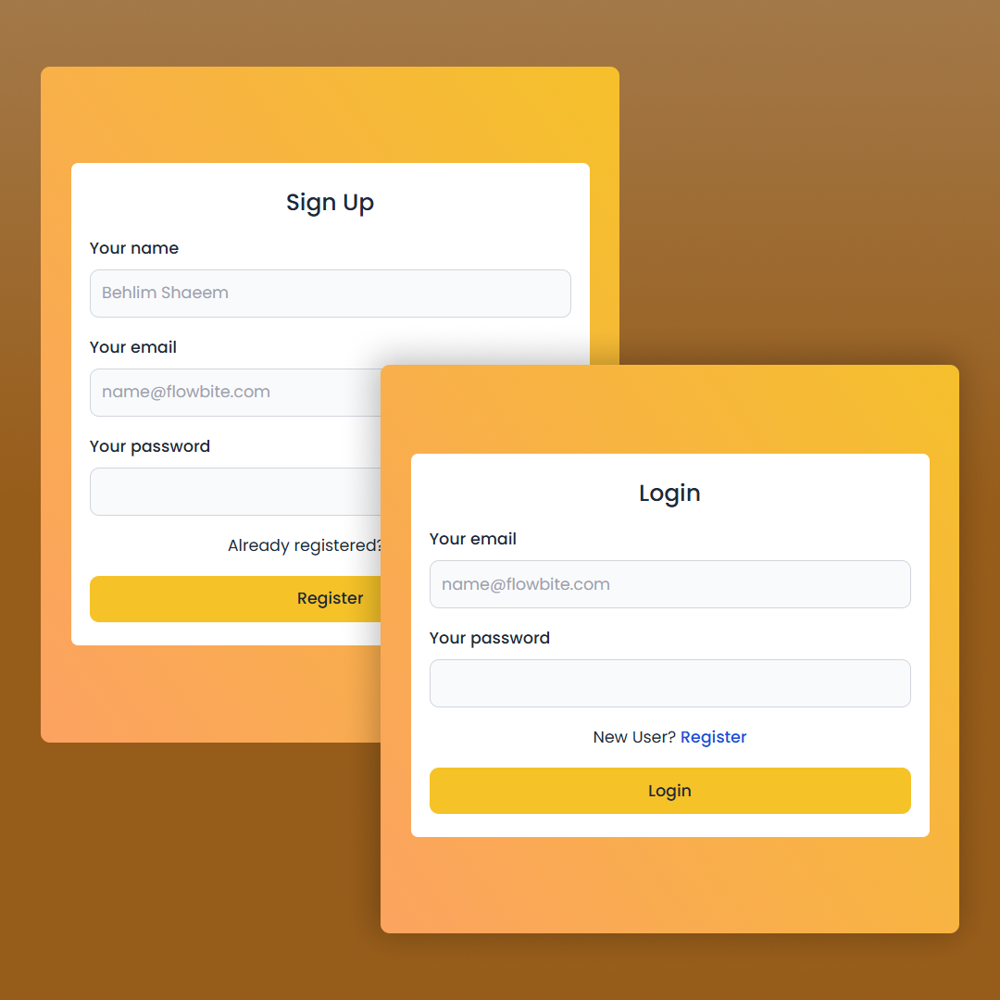
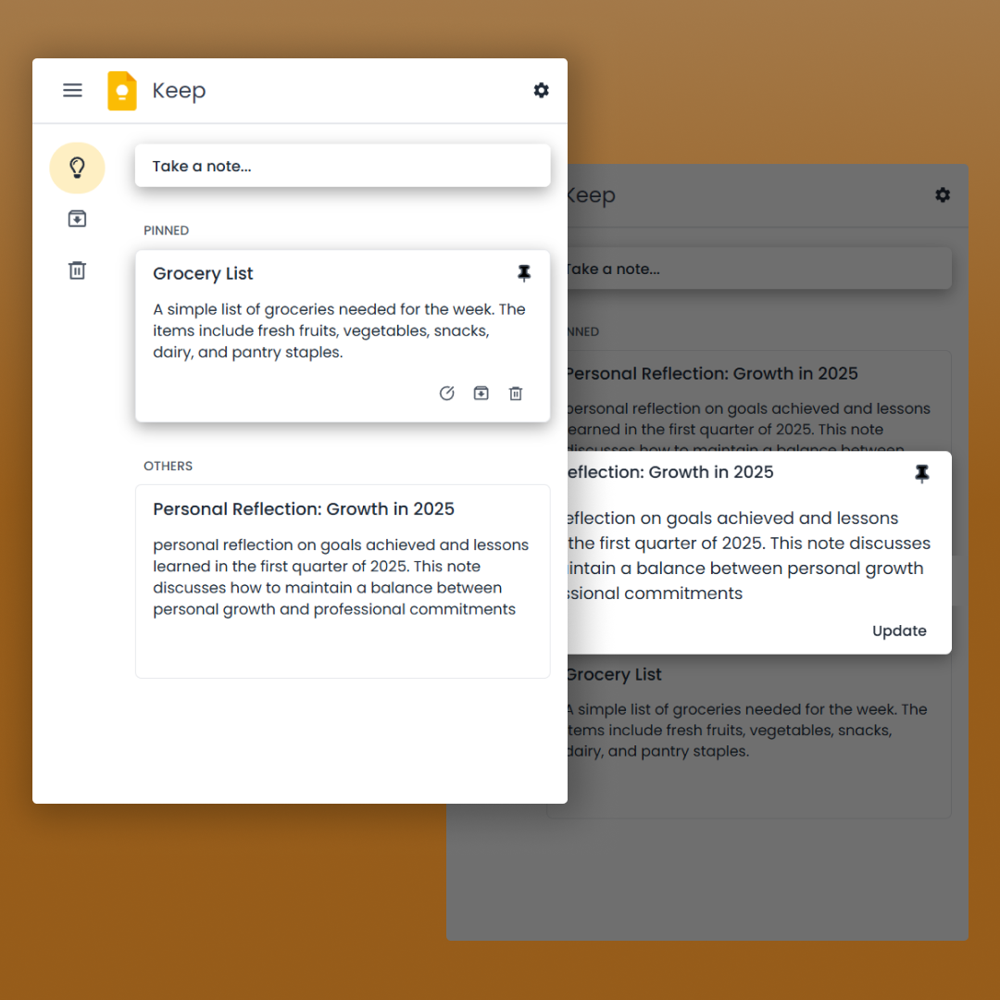

# 📝 My Keep

A full-stack notes application built using **MongoDB, Express.js, React, and Node.js (MERN stack)**. Users can create, edit, archive, pin, and delete notes seamlessly.

## 🚀 Features

- 📝 Create, edit, and delete notes
- 📌 Pin & unpin notes
- 📂 Archive & unarchive notes
- 🗑️ Move notes to trash & restore them or permanently delete them
- 🔒 User authentication with JWT
- 🎨 Responsive UI with Tailwind CSS
- 📡 Backend API with Express.js & MongoDB
- 🔔 Toast notifications for quick feedback

## 📂 Tech Stack

### **Frontend**

- ⚛️ React (Vite)
- 🎨 Tailwind CSS
- 🔥 React Icons
- 🍞 React Toastify
- 🏷️ Context API for state management

### **Backend**

- 🖥️ Node.js
- 🚀 Express.js
- 🛢️ MongoDB + Mongoose
- 🔑 JWT Authentication

## 🎯 API Endpoints

### User

| Method | Endpoint           | Description |
| ------ | ------------------ | ----------- |
| POST   | /api/user/register | User Signup |
| POST   | /api/user/login    | User Login  |

### Note

| Method | Endpoint                     | Description        |
| ------ | ---------------------------- | ------------------ |
| GET    | /api/notes                   | Fetch all notes    |
| POST   | /api/notes                   | Create a new note  |
| PATCH  | /api/notes/:id               | Update a note      |
| DELETE | /api/notes/:id               | Delete a note      |
| PATCH  | /api/notes/:id/toggle-status | Toggle note status |
| DELETE | /api/notes/bin/empty         | Empty bin          |

## 📸 Screenshots

| Auth Page                         | Home Page                         |
| --------------------------------- | --------------------------------- |
|  |  |
